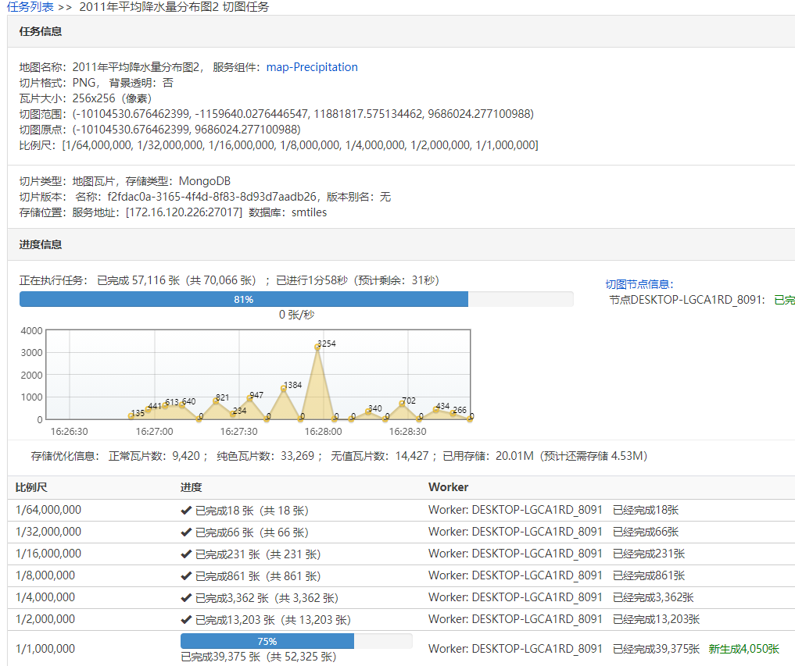
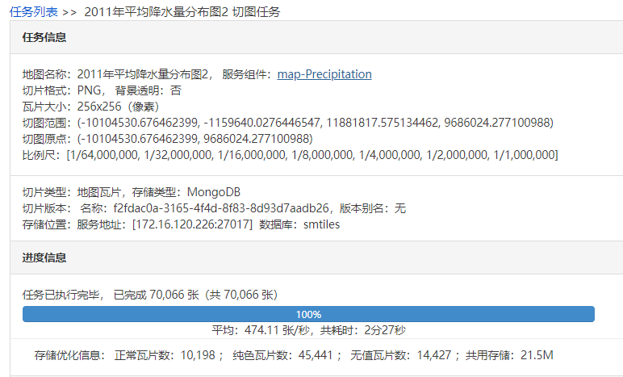
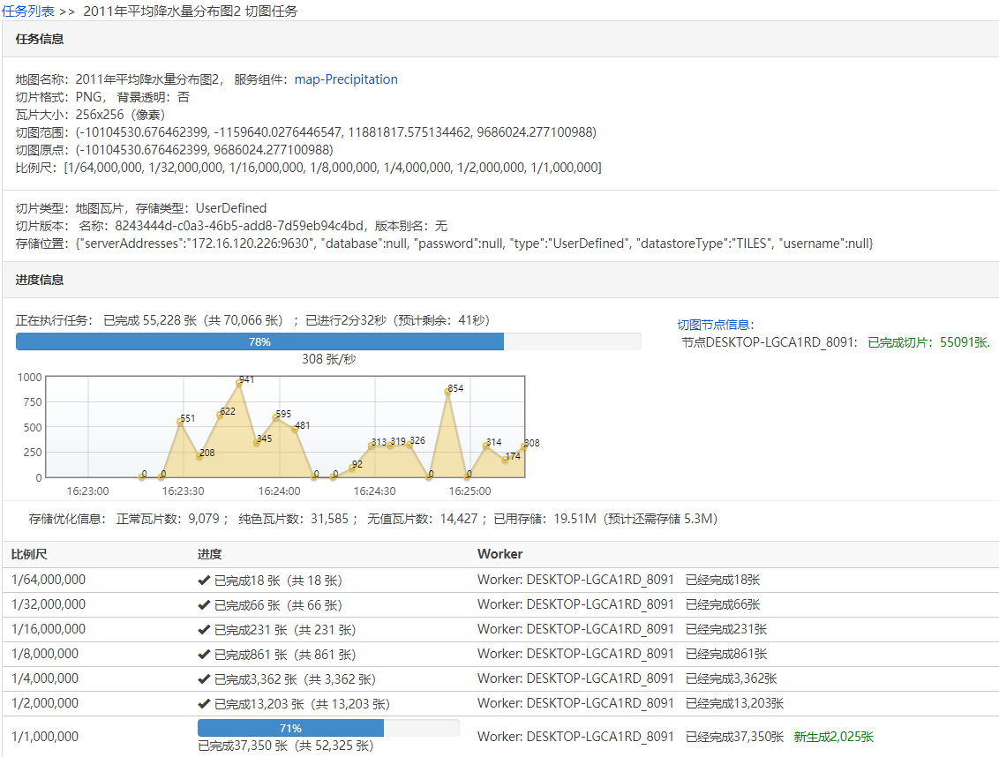
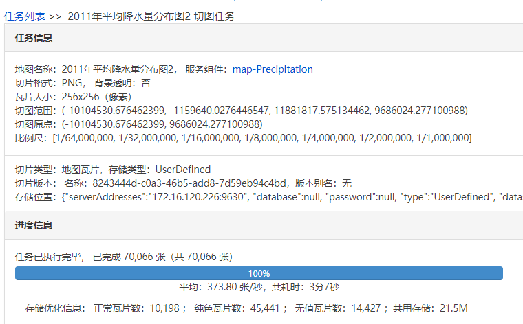

# SuperMap iserver拓展Transwarp Scope 2.0

## 集成至iserver

### 生成jar

在根目录下执行`mvn install`生成jar包，然后到target目录下复制`scope-1.0-SNAPSHOT.jar`以及lib目录下Scope的客户端jar(Shiva-xxxx.jar)复制到`%SuperMap  iServer_HOME%/webapps/iserver/WEB-INF/lib`目录下

### 配置使用Scope的存储位置

打开系统配置文件 iserver-system.xml（位于%SuperMap  iServer_HOME%/webapps/iserver/WEB-INF） ，在<storages>节点下添加存储  ID（可自行命名，本例为 Scope）和瓦片存储位置的配置。

示例： 

```xml
  <storages> 
    <storage> 
      <id>Scope</id>  
      <tileSourceInfo class="com.supermap.services.tilesource.ScopeTileSourceInfo"> 
        <serverAddresses>ip:port</serverAddresses> 
      </tileSourceInfo> 
    </storage> 
  </storages>  
```

### 配置ScopeTile服务提供者及组件

打开系统配置文件 iserver-services.xml（位于%SuperMap  iServer_HOME%/webapps/iserver/WEB-INF） ，在<providers>节点添加服务提供者的配置以及<components>节点添加地图服务组件的配置。

示例：

```xml
<application>
  ...
  <providers> 
    <provider class="com.supermap.services.providers.ScopeTileProvider" name="scopeProvider-Maps">
      <config class="com.supermap.services.providers.ScopeTileProviderSetting">
        <serverAddresses>ip:port</serverAddresses> 
      </config>
    </provider>
  </provider>
  <components>
    <component class="com.supermap.services.components.impl.MapImpl" interfaceNames="rest,wms111" name="map-scope" providers="scopeProvider-Maps"/>
  </components>
  ...
<application>

```

## 性能测试

性能测试采用MongoDB作为参考对象

### 机器配置

数据源配置：

MongoDB以及Scope都是部署在Ubuntu 18的docker容器里，均采用默认配置

iserver环境：

iserver版本：10.2.1 win64 deploy版 默认配置

机器配置：win10，16G内存，CPU为i5-6400 4核4线程

分布式切图配置：单机单进程

### MongoDB切图情况





总共耗时2分27秒

### Scope切图情况





总共耗时3分7秒
